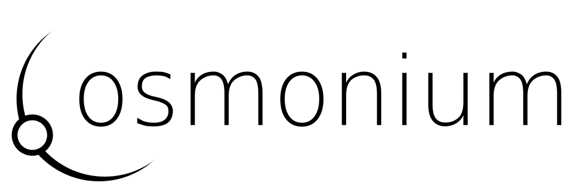

Cosmonium is a 3D astronomy and space exploration program. With Cosmonium you can navigate in our solar system and discover all the planets and their moons. You can also visit the neighboring stars and discover the true size of our galaxy and the Universe.

Cosmonium also supports (or will support) the creation of fictional planets and stellar system using procedural generation.

Cosmonium also already supports some Celestia addons (though CMOD and CelX are not yet supported).

### Requirements

Cosmonium runs on Windows, Linux or MacOS machine with a graphic card supporting OpenGL 2.1 or better (OpenGL 4.5 is recommended), 2GB of memory and at least 512MB of disk (up to 4GB if the HD and UHD textures are installed).

### Installation 

Download the package for your platform from the [Download](https://github.com/cosmonium/cosmonium/wiki/Download) page and extract the package archive file, or look at the  [Installation](https://github.com/cosmonium/cosmonium/wiki/Installation) page to install from sources.

The package contains only low resolution textures, see the [Installation](https://github.com/cosmonium/cosmonium/wiki/Installation) page to install extra HD and UHD textures.

### Screenshots

See in the [Wiki](https://github.com/cosmonium/cosmonium/wiki/Screenshots) some screenshots of the application with views of [Saturn](https://github.com/cosmonium/cosmonium/wiki/Screenshots#rings-of-saturn), [Jupiter](https://github.com/cosmonium/cosmonium/wiki/Screenshots#io-casting-a-shadow-on-jupiter), [Mars](https://github.com/cosmonium/cosmonium/wiki/Screenshots#phobos-over-mars), the [Moon](https://github.com/cosmonium/cosmonium/wiki/Screenshots#moon-crescent), [procedural planets](https://github.com/cosmonium/cosmonium/wiki/Screenshots#procedural-planet), ...

## Usage

### Launch

* On Windows : enter the cosmonium directory and open *cosmonium.exe*
* On MacOs : enter the cosmonium directory and open *cosmonium.app*
* On Linux : enter the cosmonium directory and execute *cosmonium*

### User interface

Cosmonium user interface is heavily based on Celestia, most of the command and keyboard shortcuts work the same. Go to [First steps](https://github.com/cosmonium/cosmonium/wiki/First-steps) to have an explanation of the basic command or see the [Control](https://github.com/cosmonium/cosmonium/wiki/Control) page for an exhaustive list.

### Full documentation

Cosmonium is still in its infancy, but it is already usable to explore all the planets and the moons of our solar system, all the neighbor or visible stars and much more. It also support custom content and addons, either as Cosmonium or Celestia addons.

The full documentation is available in the [Wiki](https://github.com/cosmonium/cosmonium/wiki)

### Bugs

If you encounter any problem to install or run Cosmonium, please don't hesitate to fill a bug report in the [issue tracker](https://github.com/cosmonium/cosmonium/issues) here on Github.

## License 

Cosmonium is (C) 2018-2019 Laurent Deru.

This program is free software; you can redistribute it and/or modify it under the terms of the GNU General Public License as published by the Free Software Foundation; either version 3 of the License, or (at your option) any later version.

This program is distributed in the hope that it will be useful, but WITHOUT ANY WARRANTY; without even the implied warranty of MERCHANTABILITY or FITNESS FOR A PARTICULAR PURPOSE. See the GNU General Public License for more details, which you should have received along with this program. If not, request a copy from: Free Software Foundation, Inc. 59 Temple Place - Suite 330 Boston, MA 02111-1307 USA.

Cosmonium uses several third-party libraries which are subject to their own licenses,  see [Third-Party.md](Third-Party.md) for the complete list.

Cosmonium data (textures, models, orbital elements,..) come from many sources. Their respective copyright holder, license and reference are available in the info panel of the displayed object and in the related yaml file.

## Powered by

