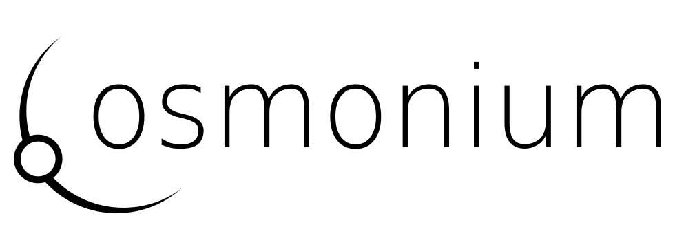

[](https://github.com/cosmonium/cosmonium/actions/workflows/ci.yml)
[](https://github.com/cosmonium/cosmonium/wiki/Download)
[](https://github.com/cosmonium/cosmonium/wiki/Download)
[](https://github.com/cosmonium/cosmonium/blob/master/COPYING.md)

Cosmonium is a free and open-source 3D astronomy and space exploration application. It lets you navigate the solar
system, look at planets and their moons up close, and travel to neighboring stars to get a sense of the scale of the
galaxy and the Universe.

It also has partial support for procedurally generated fictional planets and stellar systems, and can load some
Celestia add-ons).

Cosmonium is still under active development and has some rough edges; expect missing features and the occasional bug.

### Requirements

Cosmonium runs on Windows (7 or above), Linux (CentOS 5, Ubuntu 14 or above) or macOS (macOS 10.12 or above)
with a graphic card supporting OpenGL 2.1 or better (OpenGL 4.5 is recommended) and at least 512MB of disk
(up to 4GB if the HD and UHD textures are installed).

### Installation 

Download the installer or package for your platform from the
[download](https://github.com/cosmonium/cosmonium/wiki/Download) page and see the
[Installation](https://github.com/cosmonium/cosmonium/wiki/Installation) page for details.
The package contains only low resolution textures; see
[here](https://github.com/cosmonium/cosmonium/wiki/Download#extra-textures) to install the extra HD and UHD textures.

### Running from source

Cosmonium is written in Python and C++, and is built on top of [Panda3D](https://www.panda3d.org). To run it from a
source:

Install a recent snapshot of Panda3D 1.11.x SDK

Then perform the following commands:

```
pip install -r requirements.txt
make build
python main.py
```

See the `Makefile` for the targets used to build packaged releases.

### Screenshots

See in the [Wiki](https://github.com/cosmonium/cosmonium/wiki/Screenshots) some screenshots of the application with
views of
[Saturn](https://github.com/cosmonium/cosmonium/wiki/Screenshots#rings-of-saturn),
[Jupiter](https://github.com/cosmonium/cosmonium/wiki/Screenshots#io-casting-a-shadow-on-jupiter),
[Mars](https://github.com/cosmonium/cosmonium/wiki/Screenshots#phobos-over-mars),
the [Moon](https://github.com/cosmonium/cosmonium/wiki/Screenshots#moon-crescent),
[procedural planets](https://github.com/cosmonium/cosmonium/wiki/Screenshots#procedural-planet), ...


### Launch

Simply starts cosmonium from your application menu or from the cosmonium folder. See also the
[installation](https://github.com/cosmonium/cosmonium/wiki/Installation) page for more options.

### User interface

Cosmonium user interface is still heavily based on Celestia, most of the command and keyboard shortcuts work the same.
Go to [First steps](https://github.com/cosmonium/cosmonium/wiki/First-steps) to have an explanation of the basic command
or see the [Control](https://github.com/cosmonium/cosmonium/wiki/Control) page for an exhaustive list.

### Documentation

The full documentation, including installation notes, controls and add-on support, is available in the
[Wiki](https://github.com/cosmonium/cosmonium/wiki).

### Reporting bugs

If you run into a problem installing or running Cosmonium, please file a bug report in the
[issue tracker](https://github.com/cosmonium/cosmonium/issues).

## License 

Cosmonium is (C) 2018-2026 Laurent Deru.

This program is free software; you can redistribute it and/or modify it under the terms of the GNU General Public
License as published by the Free Software Foundation; either version 3 of the License, or (at your option) any later
version.

This program is distributed in the hope that it will be useful, but WITHOUT ANY WARRANTY; without even the implied
warranty of MERCHANTABILITY or FITNESS FOR A PARTICULAR PURPOSE. See the GNU General Public License for more details,
which you should have received along with this program. If not, request a copy from: Free Software Foundation, Inc. 59
Temple Place - Suite 330 Boston, MA 02111-1307 USA.

Cosmonium uses several third-party libraries which are subject to their own licenses, see
[THIRD-PARTY.md](THIRD-PARTY.md) for the complete list.

Cosmonium data (textures, models, orbital elements,..) come from many sources. Their respective copyright holder,
license and reference are available in the info panel of the displayed object and in the related yaml file.

## Powered by

[](http://www.python.org)

[](http://www.panda3d.org)
